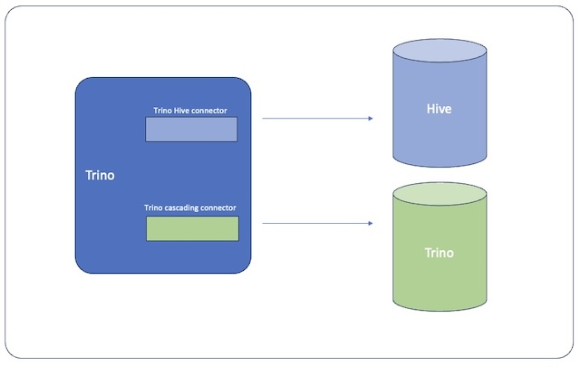

# Trino Plugin



This is a plugin for Trino that allows you to connect to multiple Trino clusters and query data located in other Trino clusters.

Notice that it only supports the SELECT queries.

## License

This project is licensed under the Server Side Public License (SSPL), v 1. See the [LICENSE](./LICENSE) file for details.

## Build
Build the plugin with the following command:

```bash
mvn package -DskipTests
```

The package of the plugin will be created in the `target/package` directory.
Install the plugin by unpacking the package and then copying the directory to the plugin directory of Trino.

## Connection Configuration
Create new properties file like <catalog-name>.properties inside etc/catalog dir:

```text
connector.name=trino
connection-url=jdbc:trino://{ip}:{port}/{catalogname}
connection-user=my_user
connection-password=my_password
```

The `connection-url` is the URL of the the Trino cluster, need to contain the catalog name.